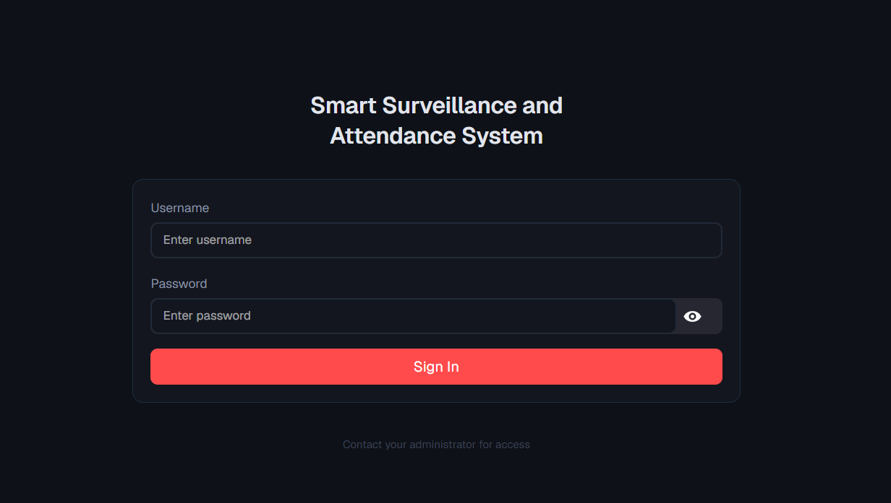
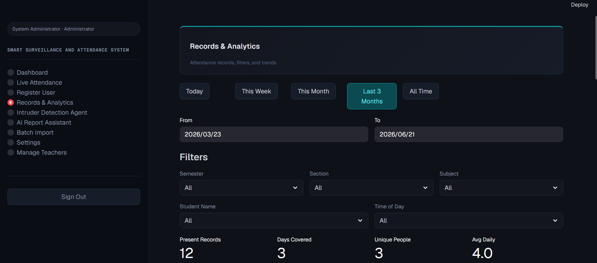
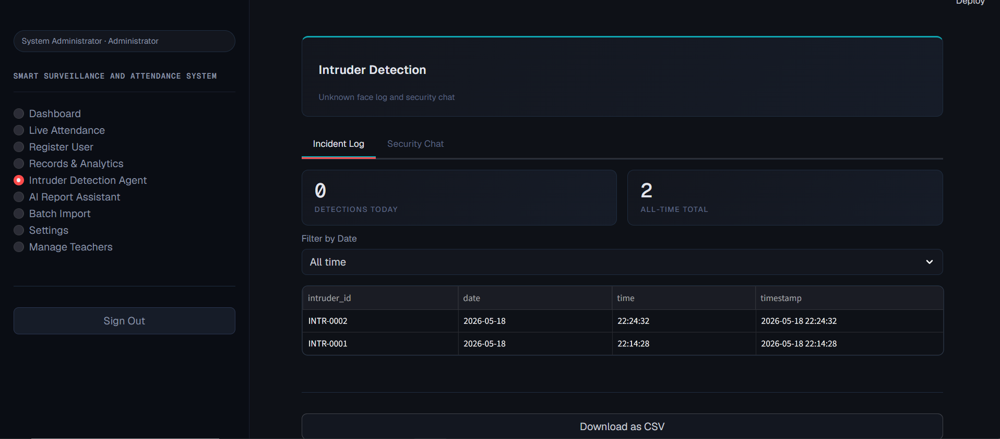
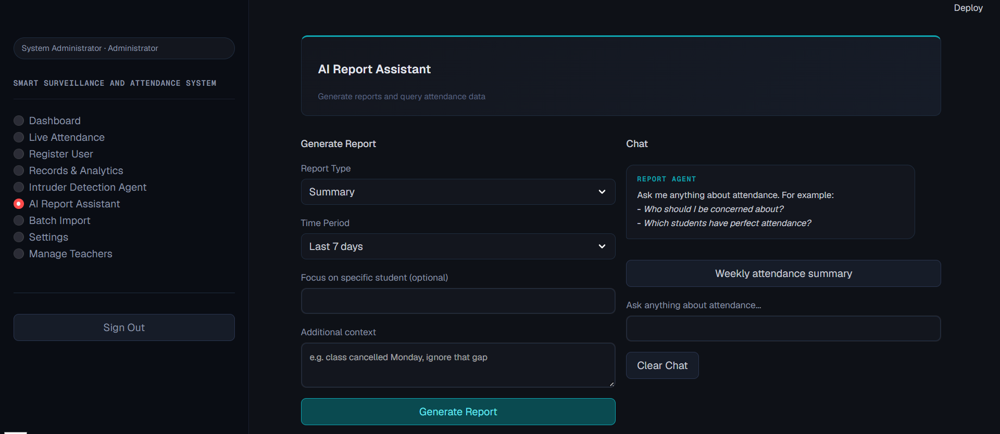

# FaceAttend Pro

Real-time face recognition attendance and surveillance system built with Streamlit.

## Features
- Real-time face detection and recognition using InsightFace (buffalo_sc) with ArcFace embeddings
- Fast matching via vectorized cosine similarity against a precomputed embedding matrix
- Registration pipeline with torchvision-based image augmentation (flips, rotation, color jitter, affine/perspective warps) to generate robust training data from a few source photos per person
- Duplicate-face detection on registration
- Session-based attendance marking with automatic absent-flagging for unseen users
- Intruder detection: logs unauthorized faces with detection/quality scores and raises AI-generated alerts via Groq
- Smart Report Agent: a Groq-powered chat assistant that answers natural-language questions about attendance data, grounded strictly in real data
- Batch import to fine-tune the recognition model from a CSV dataset
- Role-based access for admins and teachers

## Tech Stack
Python 3.10, Streamlit, OpenCV, InsightFace, ONNX Runtime, PyTorch/Torchvision, Pandas, Groq API

## Screenshots

**Login**


**Dashboard**


**Live Attendance**


**Register User**


**Attendance Records**


**Intruder Detection**


**Smart Report Agent**


**Settings**


## Setup

Tested on Python 3.10.10.

1. Clone the repo
```
git clone https://github.com/h-arshadd/faceattend-pro.git
cd faceattend-pro
```

2. Create and activate a virtual environment (recommended)
```
python -m venv venv
venv\Scripts\activate
```

3. Install dependencies
```
pip install -r requirements.txt
```
Note: InsightFace can occasionally be tricky to install on Windows. If `pip install insightface` fails, try installing a prebuilt wheel matching your Python version, or refer to the [InsightFace docs](https://github.com/deepinsight/insightface).

4. Create a `.env` file in the project root:
```
GROQ_API_KEY=your_groq_api_key_here
```

5. Run the app
```
streamlit run app.py
```

6. Default login: username `admin`, password `admin123` (change after first login)

## Notes
This was developed as a Final Year Project. The batch import feature expects a CSV with `image` and `label` columns; no sample dataset is included due to privacy (real student data was used during development and testing).

## Author
Huda Arshad